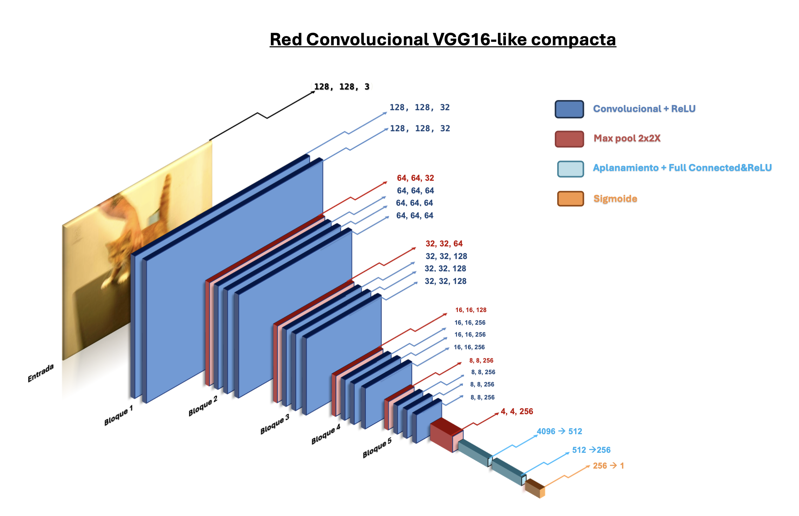
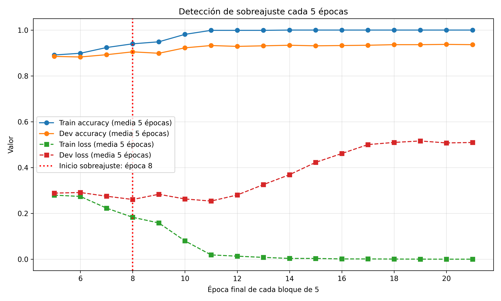

# Clasificación de perros y gatos con una RNN tipo VGG16

## Descripción del proyecto
Este proyecto desarrolla un modelo de clasificación binaria de imágenes mediante una red neuronal convolucional inspirada en la arquitectura VGG16. El objetivo es distinguir entre imágenes de perros y gatos a partir del conjunto de datos Dogs vs Cats.

El trabajo incluye el diseño de la arquitectura, el entrenamiento del modelo piloto, el análisis del rendimiento, la evaluación del sobreajuste, la visualización de resultados y la generación de predicciones sobre nuevos casos.

## Arquitectura:
Red Connvolucional (RNN) compacta, reducida la dimensionalidad a la mitad de la VGG16 original.

## Base de datos:
Se utilizó el conjunto de datos Dogs vs Cats de Kaggle.

La base de datos no se incluye en este repositorio debido a las limitaciones de tamaño de GitHub. Para reproducir el proyecto, es necesario descargar el dataset original y organizarlo con la estructura esperada por el código.

## Rendimiento y Overfiting:
Evolución de la precisión y la pérdida durante las épocas, sobreajuste en la época 8.

